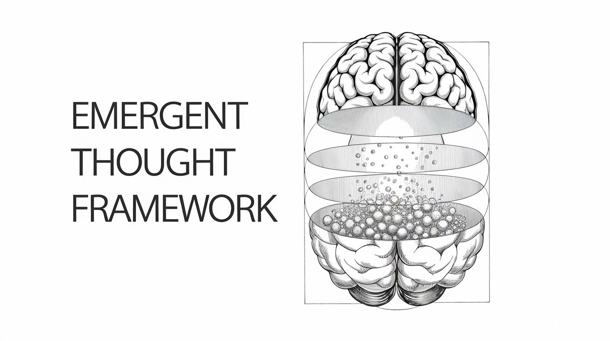

# Hungry Emergent Cognition Framework (HECF): A General Architecture for Creative Synthesis in Artificial Intelligence

  

## Abstract

The Hungry Emergent Cognition Framework (HECF) offers a novel approach to creative AI, overcoming limitations of deterministic systems through a multi-layered architecture that fosters emergent behavior. By dynamically integrating stochastic processes, context-aware memories, and hierarchical evaluations, HECF generates diverse, refined outputs applicable across domains. Key to HECF is its domain-agnostic design, enabling broad applicability and a framework for simulating artificial intuition. A unique "Hungry Matrix" option further enriches this process with an adaptive approach to data encoding where low-resolution areas act as abstract concepts for enhanced learning. This system, validated through LLM scenario generation, signifies a crucial step toward adaptable and innovative Artificial General Intelligence (AGI).

---

## 1. Introduction

Modern Artificial Intelligence (AI) faces a crucial challenge: fostering genuine creativity and adaptability. While proficient in many tasks, contemporary AI systems often fall short in generating novel and contextually relevant outputs due to their reliance on rigid, pre-defined algorithms. To address this gap, we introduce the Hungry Emergent Cognition Framework (HECF), a multi-layered architecture engineered to unlock creative synthesis through emergent behaviors. HECF achieves this by strategically combining controlled randomness with structured information, activating and weighting internal data representations (memories) based on contextual relevance. This dynamic interplay, further enhanced by hierarchical evaluation, provides a path to generating more varied and insightful AI outputs. Furthermore, HECF is designed to work with various technologies, offering an intuitive approach to creative problem-solving that has the potential to enhance AGI systems. The flexibility of HECF is paramount; it is explicitly designed to function across multiple domains, not just within a narrow application. The underlying methods for pattern creation, scenario development, and evaluation are universally applicable in different technologies, from language models to visual and audio synthesis, and even abstract reasoning tasks. Our research begins with testing scenario generation within Large Language Models (LLMs). This gives a starting point to validate how well the framework can enhance creative thought and the framework is further enhanced by an optional, dynamically adapting "Hungry Matrix" feature. This matrix expands as it "hungers" for more information, creating more abstract and complex representations of the data, akin to how humans learn through the combination of abstraction and concrete definitions, opening the door to a more creative and human-like AI.

---

## 2. Theoretical Foundations

### 2.1. Core Principles of Operation

The Hungry Emergent Cognition Framework (HECF) is founded upon three core principles, meticulously designed to enable broad applicability and pave the way toward advanced Artificial General Intelligence (AGI). These principles, when working in harmony, enable the simulation of intuitive processing and creativity within artificial systems:

#### 1. Stochastic-Deterministic Balance: 
The HECF strategically balances randomness and structure, creating an essential dynamic for creative innovation. 
* Controlled Randomness: HECF introduces carefully calibrated multi-scale noise patterns, which introduce the needed variability and exploration. This allows the system to explore new creative paths by going off-script and exploring new, creative paths that may not have been originally available. This controlled chaos ensures the system can escape local optima and discover novel solutions. Without this noise, the model would be trapped in local minima. This also is inspired by studies showing that neural noise plays a significant part in the formation of complex creative ideas. 
* Structured Constraints: To maintain meaningful and relevant output, randomness is balanced by a framework of defined boundaries, these ensure that the system is not just producing random noise, but using that noise to produce valid and usable data that has meaning. By combining exploration with structure the model is both creative and practical. This balance is key for building an adaptive system.
* Emergent Interaction: The core of this approach lies in the dynamic interplay of stochastic and deterministic processes which, in their interaction, facilitate the emergence of novel solutions. This creates a constantly evolving process of creative exploration, and the emergence of new patterns. Like in nature, chaos and structure are equally important for the development of new forms and new ideas. The deterministic side, grounded in memory and context, provides stability, and the stochastic side, fueled by noise, promotes change.

#### 2. Dynamic Memory Integration: 
The framework's dynamic memory management system prioritizes relevant, recent information, enhancing both efficiency and creative exploration. 
* Temporal Decay Management: The system uses mechanisms that give higher priority to recent and relevant information, and gradually phasing out older, less relevant data. This decay mechanism is necessary to prevent data overload, and also to ensure that the model learns the most recent, and important data, and prevents past, outdated data from negatively affecting the results. This is similar to human memory systems where relevant memories are given higher priority while others decay. 
* Contextual Relevance: By retrieving memories based on current context, the system ensures that scenario generation is aligned with current objectives, allowing for more relevant results, while also being creative. The interaction between current and past context is a fundamental feature of the model. 
* Pattern Emergence: This is achieved through the system using iterative memory interaction to synthesize new patterns. By exploring current contexts through the lens of past knowledge, the system can find novel relationships and synthesize new creative patterns, which enables adaptive learning and creative growth.

#### 3. Hierarchical Evaluation Structures: 
HECF's evaluation process is multi-faceted, incorporating different dimensions to create more optimal results. 
* Multi-Criteria Assessment: Instead of a simple evaluation, scenarios are assessed across various dimensions including plausibility, relevance, novelty, and utility. This process helps the model make a more informed decision regarding what is the best possible output. This also mirrors human like judgement in evaluating scenarios, where multiple angles are used to determine its effectiveness. 
* Domain-Adaptive Metrics: The criteria used are adapted to suit specific applications, which makes this framework versatile in diverse areas, as it ensures that the metrics used will provide a better output for each unique application, making it both relevant, and practical. This flexibility is paramount for a system designed to tackle different fields. 
* Emergent Selection Processes: The system dynamically prioritizes scenarios, which promotes innovative, contextually appropriate outputs. This not only selects for high utility scenarios, but also adds a creative exploration to the evaluation by keeping some novelty or random outputs.

These three principles work synergistically to empower HECF to mimic elements of intuitive reasoning, enabling AI systems to generate, evaluate, and refine creative solutions autonomously, much like how humans do. This approach is a significant advancement towards achieving AGI because it allows for adaptability and creative problem-solving, allowing it to tackle novel and complex problems that other systems are not able to overcome. The end result is an adaptable, creative, and intuitive AI system that is inspired by human cognition and thought processes.

---

### 2.2. Core Components of HECF

The Hungry Emergent Cognition Framework is structured into five distinct layers, each performing a specific function that contributes to the overall goal of creative synthesis:

#### **Layer 1: Noisy Memory Activation and Contextual Integration**

This foundational layer represents a dynamic and noisy representation of the AI's internal data, integrating past experiences with the current context. This layer introduces a novel approach by using embeddings as the underlying data representation, coupled with a dynamic noise injection process, inspired by neural noise theories in cognitive science. Additionally, this layer may optionally include a dynamic "Hungry Matrix" that replaces the standard embedding data representation, where low-resolution sub-structures can act as abstract concepts. This matrix adapts to data through abstraction and definition, acting as a core component for creative exploration.

*   **Data Space Representation:**
    *   **Standard Option:** Represents the AI's knowledge base, such as training data, stored as token embeddings. This choice allows for a rich representation of semantic relationships and facilitates the integration of context. This acts as a standard method of processing text data.
    *   **Optional Enhancement ("Hungry Matrix"):** As an optional enhancement, instead of standard embeddings, this layer can utilize a dynamically adaptive multi-dimensional matrix to encode and abstract features. This starts as a low-resolution matrix, where low-resolution sub-structures represent *abstract concepts*, and expands based on a "hunger" metric, defining more specific features by expanding into higher resolution sub-structures, simulating a "learning by abstraction" strategy, much like humans. The low-resolution matrix sub-structures naturally represent generalized abstract concepts, while the higher-resolution represents the more concrete concepts. **The expansion of the "hungry matrix" is controlled by a "hunger" mechanism, designed to monitor the training progress and trigger expansion when needed.**
        *   **Initial Low Resolution:** The matrix starts with a predefined low resolution (e.g., a 2x2 matrix, or similar simple structure) that represents a highly abstract, generalized concept space.
        *   **"Hunger" Metric:** The system continually calculates a "hunger" metric to gauge if it is learning and abstracting enough of the information, or if the system is stuck in a particular area of the data space. This metric is derived from several factors which include:
            *   **Training Loss**: If the training loss decreases and reaches a stable point, this means that the system may have extracted the maximum amount of information out of the current matrix resolution and can expand it into more sub-structures to acquire more.
            *   **Fluctuation of Data**: During training if the matrix sub-structures have reached stability and are no longer fluctuating too much from training, it would also indicate that no more information is being encoded into them and the matrix can expand. The average fluctuation per epoch is a key factor of this metric.
            *   **Entropy**: Calculating the entropy of each sub-structure within the matrix helps evaluate if it's capturing a lot of information, or if it's become too homogeneous. If the entropy drops below a specific threshold, this indicates that the matrix isn't as "hungry" for new information.
            *  **Time based**: A simple timer that triggers an expansion event based on how long the model has been training since the last expansion.
        *   **Expansion Trigger:** The expansion is triggered when the hunger metric reaches a certain threshold. This means that the system has, for a specific amount of time, reached a stable training stage, and is no longer fluctuating its outputs as much. This will trigger the expansion into sub-structures of higher resolution to create more concrete definitions of its learned data.
        *   **Expansion Mechanism:** The matrix expansion involves creating new dimensions or sub-structures from areas in the matrix that are stable. The expansion mechanism uses multiple methods to provide new structures to the system:
             * **Sub-Matrix Creation**: A new higher resolution sub-matrix can be created at an area where the training has stabilized. For example, a 2x2 area becomes its own higher resolution matrix.
             * **Dimensional Increase:** New dimensions can be added to existing matrix to represent more concepts and sub concepts.
             * **Hybrid**: The model can dynamically switch between sub-matrix creation and dimensional increases.
        *   **Resolution Levels:** These processes repeat, leading to multiple layers of matrix resolutions, where each resolution level represents an increasingly refined understanding of the data.
*   **Memory Activation:** When new context is provided to the AI (e.g., a user input or a system-generated cue), related memories are activated. These memories are identified based on the similarity of their embeddings (or "hungry matrix" sub-structures) to the current context, using metrics like cosine similarity.
*   **Importance Weighting:** The activated memories' embeddings (or "hungry matrix" sub-structures) are assigned higher importance weights within the data space, proportional to their relevance to the current context. This highlights relevant knowledge and experiences.
*   **Noise Injection:** Controlled stochastic noise is introduced into the weighted data space at multiple scales. “Soft noise” introduces broad associations, while “fine-grained noise” explores specific connections. This noise is also influenced by past noise patterns, creating a "momentum" effect that introduces temporal dependencies and directionality into the exploration.
*   **Residual Integration**: A small amount of the previous layer's output is integrated into the current layer to establish a temporal link between successive operations, further enhancing temporal dynamics.
*   **Example:** With the input "a person walks to a horse farm," the tokens "person," "walk," "horse," and "farm" would have their embeddings weighted higher, or would be encoded into the "hungry matrix." The noise would cause variations in these weights, briefly highlighting related or unexpected tokens, thereby expanding the space of possible scenarios. Using the optional hungry matrix enhancement, the initial low-resolution matrix may only abstract the core concepts like "Person," and "Place." As the model trains, and the "hunger" metric reaches its threshold the matrix will begin to expand into sub-structures to define the relationships, and more concretely represent its knowledge of "person" and "place," which will become its own concepts to use in future creative output.

Layer 1 provides a robust foundation for creative exploration. The integration of noise with contextual memory and temporal dependencies ensures that the system explores a diverse range of possibilities while remaining rooted in relevant, prior knowledge. The optional inclusion of the hungry matrix provides an additional method for more complex, dynamically adapting abstraction and concept representation, allowing the model to learn and create more creative outputs.

---

#### **Layer 2: Significant Data Element Extraction**

This layer acts as a filter on the noisy data space, identifying the most salient data elements.

*   **Peak and Valley Identification:** This layer identifies “peaks” (data elements with high importance weights) and “valleys” (data elements with low importance weights).
*   **Controlled Randomness (Minimal):** A small subset of “valleys” (low-importance elements) are also selected to introduce minimal unexpected variations, ensuring that the system doesn’t get trapped in local optima. This is crucial for introducing novelty and avoiding repetitive outputs.
*  **Abstract Concept Extraction:** With the optional "Hungry Matrix," low-resolution sub-structures representing abstract concepts may also be extracted.
*   **Output:** A refined set of data elements—primarily peaks, with a few valleys, and with the hungry matrix implementation this also includes abstract concepts from low resolution sub-structures—is passed to the next layer.

Layer 2 strategically filters the vast array of possibilities, highlighting elements with potential for generating valuable and diverse scenarios. It maintains a balance between focusing on high-utility patterns and introducing random exploration to prevent stagnation. This layer is inspired by the idea that both highly activated and seemingly irrelevant information can contribute to creative insights. When using the optional "hungry matrix" the layer identifies key sub-structures, including abstract concepts in low-resolution sub-structures within the matrix, to pass on to the next layer.

#### **Key Functions**

1.  **Pattern Recognition:**
    *   Peak Identification (Opportunities)
    *   Valley Identification (Unrelated Ideas)
    *  Abstract Concept Extraction (if using "Hungry Matrix")
2.  **Controlled Randomness:**
    *   Variability Introduction
    *   Avoiding Stagnation

**Output:** A refined set of data points, representing significant opportunities and selected unrelated ideas, or if using the hungry matrix, a set of relevant sub-structures including abstract concepts.

---

#### **Layer 3: Hypothetical Scenario Generation**

This layer leverages the extracted data elements to construct potential scenarios. It now emphasizes *concept-driven* scenario generation, ensuring that the scenarios are grounded in both concrete and abstract concepts.

*   **Scenario Construction:**
    *   **Concept Selection:** This layer receives significant data elements from layer 2, including token embeddings, sub-structures from the "hungry matrix," and any abstract concepts that were extracted using the "hungry matrix."
    *   **Concept Anchors:** Layer 3 uses these identified concepts as anchors for scenario generation.
    *   **Concept-Driven Generation:** The scenario generator (e.g., an LLM) constructs scenarios that incorporate these concepts in a plausible manner. These can be abstract or concrete concepts. The goal is for the output to be creative, and thus not limited to just using specific concepts if the context demands otherwise.
    *    **Concept Expansion**: The scenario generator can also expand on the selected concepts. For instance, if a concept is "innovation" then the model may expand on it using different ways. Or if the main concept was "food," the expansion may be "italian food."
    *   **Novel Concept Creation:** Scenarios can also introduce *new* concepts that combine or extend existing ones, potentially leading to more innovative outputs.
    *    **Multi-Concept Linkage:** The focus here is to create scenarios that emphasize a clear relationship between different concepts, not just a set of random scenarios.
*  **Hierarchical Scenario Planning:**
    * **Abstract Planning:** Through the use of concept embeddings, the model can generate scenarios at varying levels of abstraction, detailing them through more concrete concepts and scenarios.
    *   **Dynamic Planning:** The model can modify and evolve the scenarios to explore new possibilities and pathways.
*   **Residual History:**
    *   **Concept-Aware Memory:** The residual history mechanism stores information about recently used or generated concepts, influencing the scenario generation to explore related themes or avoid repetitive outputs.
*   **Example:** Using the "horse farm" example, with concepts like “person,” “horse,” “farm,” and potentially abstract concepts like "connection" or "nature," this layer could generate scenarios like:
    *   "A person rides a horse on a farm, enjoying a connection with nature."
    *  “The person visits the farm to create a connection with the horses"
    *   "The person is thinking about what kind of farm she should buy."
    * "The person dreams of riding a horse on the beach."

    These scenarios are diverse, while maintaining the intended relationships between those abstract concepts.

Layer 3 serves as the creative engine of HECF, transforming extracted data elements, including abstract concepts, into diverse hypothetical scenarios. It emphasizes a concept driven approach to scenario generation ensuring the AI remains both proactive and innovative.

#### **Key Functions**

*   **Scenario Creation:**
    *   Continuous Generation
    *   Range of Possibilities
*  **Scenario Evolution:**
    *   Adaptive Refinement
    *   Learning Mechanisms
*  **Concept Integration:**
    *   Abstract Concept Utilization
    *   Multi Concept Linkage

**Output:** A diverse set of hypothetical scenarios, grounded in both concrete and abstract concepts, ready for evaluation.

---

#### **Layer 4: Scenario Evaluation and Ranking**

This layer evaluates the generated scenarios based on multiple criteria to determine their value and relevance, with an emphasis on concept adherence and exploration.

*   **Multi-Criteria Assessment:** Scenarios are evaluated across multiple dimensions:
    *   **Plausibility:** The likelihood of the scenario occurring in the real world.
    *   **Relevance:** How well the scenario aligns with the current context.
    *   **Novelty:** The degree to which the scenario differs from previously generated ones.
    *   **Utility:** The usefulness of the scenario for the AI's current task.
    *   **Concept Adherence:** How well the scenario incorporates the identified concepts, including abstract concepts, and the degree to which it explores relationships between them.
*   **Ranking:** Scenarios are ranked based on a weighted combination of these criteria, allowing for dynamic prioritization.
*   **Output:** A ranked list of scenarios with associated scores, serving as the basis for the next selection step.

Layer 4 ensures that scenarios are not only diverse but also useful and contextually appropriate. This evaluation now explicitly includes how well scenarios explore the relationships between concepts and are grounded by abstract concepts, ensuring a balanced creative and logical output.

#### **Key Functions**

1.  **Consolidation:**
    *   Clustering Techniques
    *   Redundancy Reduction
2.  **Utility and Creativity Balancing:**
    *   Composite Scoring
    *   Relevance Assessment
   *  **Concept Adherence:**
        *  Exploration of Concept Relationships
        *   Abstract Concept Grounding

**Output:** A ranked list of scenarios with associated scores, with concept adherence as an added metric.

---

#### **Layer 5: Surface-Level Scenario Selection**

This layer selects the most promising scenarios and prepares them for integration with external systems.

*   **Selection:** The top *N* ranked scenarios (e.g., 3-5) are chosen, including a mix of high-scoring and low-scoring scenarios (to maintain exploration), based on the rankings in the previous layer. The system also prioritizes scenarios that represent abstract concepts well to ensure a balance between practicality and abstract concepts.
*   **Integration:** The selected scenarios are presented to the downstream system in a format that is compatible, which for LLMs would be appending them to the prompt, or using them to bias the generation process. The inclusion of lower-ranked scenarios serves as negative examples, guiding the system toward more optimal and relevant solutions.
*   **Example:** In a Chain-of-Thought prompting scenario, the selected scenarios would be added to the prompt before generating the final answer, using the top-ranked scenarios as potential solutions, and lower ranked scenarios as negative examples. It may also include abstract concepts in the prompt to influence the language models output in novel and creative ways.

Layer 5 acts as the interface between HECF and external systems, providing optimized scenarios for immediate use.

#### **Key Functions**

1.  **Selection Criteria:**
    *   Reward Potential
    *   Diversity Factor
    *   Abstract Concept Representation
2.  **Weighted Scoring:**
    *   Dynamic Adjustment
    *   Composite Evaluation
3.  **Thresholding and Filtering:**
    *   Minimum Standards
    *   Redundancy Penalization

**Output:** A curated set of scenarios, optimized for actionability, with a balance of practicality and abstract concept exploration.

---

## 3. Operational Mechanics of HECF

1.  **Background Processing:**

    ECF is designed to function flexibly to accommodate a variety of operational modes, including both continuous, real-time adaptation and single-call, on-demand processing.
    *   **Continuous Mode**: Allows HECF to adapt dynamically to changing inputs for long-term monitoring or iterative creative processes.
    *  **Single-Call Mode:** Outputs are generated on demand for immediate use.
    This dual capability ensures HECF is applicable across a range of scenarios, from static to dynamic systems.

2.  **Complementary Role:**

    *   **Non-Intrusive Integration:** HECF is designed to enhance existing systems without disrupting their primary functions.
    *   **Decision Support:** HECF provides valuable context and a range of options for decision-making, whether running continuously or on-demand.

3.  **Adaptive Feedback Loop:**

    *   **Learning from Outcomes:** HECF’s internal models are updated based on the success or failure of scenarios.
    *  **Alignment Improvement:** Scenario generation is refined to better match system objectives and operational mode (continuous or single-call).

By functioning as an on-demand processor and potentially simulating aspects of intuitive processing, HECF empowers AI systems to transcend deterministic limitations, fostering a more holistic and adaptable form of intelligence tailored to diverse operational needs.

---

## 4. Example Use Cases

The applications of HECF extend across numerous domains where creativity, prediction, and adaptive decision-making are essential. Here are a few examples of potential use cases:

### 4.1. Enhanced LLM Reasoning

*   **Function:**  Improves LLM's reasoning capabilities and reduces hallucinations by providing pre-generated scenarios, including abstract concepts.
*   **Example:** LLMs provided with multiple potential solutions, negative examples, and abstract concepts can refine their reasoning process.

### 4.2. Creative Content Generation

*   **Function:** Generates novel ideas for various creative content, including stories, music, and visual arts.
*   **Example:**  A music composition system can use HECF to create innovative melodic patterns and rhythms, while a visual art generation tool can explore unconventional styles and compositions using abstract concepts.

### 4.3. Risk Assessment

*   **Function:** Helps identify and mitigate risks by generating potential scenarios.
*   **Example:** A cybersecurity AI can explore potential threat vectors using hypothetical scenarios to proactively address vulnerabilities. Similarly, a supply chain management system could anticipate disruptions and recommend adjustments using HECF using abstract concepts to navigate complex scenarios.

### 4.4. Adaptive Learning Environments

*   **Function:** Personalizes learning by generating tailored educational scenarios and materials.
*   **Example:** An AI tutor can generate exercises based on hypothetical misunderstandings to cater to a student’s unique learning path, while incorporating abstract concept to develop more advanced educational methods.

### 4.5. Predictive Scenario Generation

*   **Function:** Generates forward-looking scenarios for strategic planning.
*   **Example:** A financial AI uses diverse predictive scenarios to anticipate market trends. This can also extend to logistics, where HECF predicts disruptions and suggests adjustments, incorporating abstract concepts to navigate unprecedented situations.

### 4.6. Strategic Risk Awareness

*   **Function:** Identifies potential challenges and preemptively addresses risks.
*   **Example:** A cybersecurity AI explores potential threat vectors. In healthcare, HECF could simulate disease outbreak risks, allowing for early intervention using abstract concepts for more advanced planning.

### 4.7. Creativity Enhancement

*   **Function:** Injects novel ideas into creative processes.
*   **Example:** A design AI can explore unconventional styles, or an entertainment AI can generate narrative-driven video games that adapt to player choices and incorporate abstract concepts.

### 4.8. Goal-Oriented Augmentation

*   **Function:** Supports goal-driven AI by proposing alternative strategies.
*   **Example:** An autonomous vehicle could consider scenic routes, or an urban planning AI could explore city layouts that optimize resource use, using abstract concepts to better define objectives.

### 4.9. Subconscious-Like Simulations for AGI Development
   *   **Function:** Mimics intuitive reasoning to advance AGI capabilities.
    *   **Example:** Simulating thought processes to allow AGI to explore abstract, long-term planning and to assess implications of advanced technologies by using its own generated abstract concepts.

### 4.10. Climate and Environmental Modeling
  *   **Function:** Generates adaptive models for environmental challenges.
   *  **Example:** Simulating long-term climate impact scenarios based on current trends to help governments create resilience strategies against global warming and natural disasters, while using its own generated abstract concepts for creative methods.

---

## 5. Conclusion

The Hungry Emergent Cognition Framework (HECF) presents a novel approach to enhancing creative synthesis in AI. By integrating controlled stochastic processes with dynamic memory interaction and hierarchical evaluation, HECF facilitates the emergence of diverse and contextually relevant outputs. Its domain-agnostic nature makes it suitable for a broad range of AI tasks, from enhancing LLM reasoning to enabling adaptive learning environments and creative content generation. Our initial research focusing on scenario generation within LLMs serves as a robust validation platform for HECF. Future work will explore scaling HECF for multi-modal applications, incorporating real-time feedback mechanisms, and further refining the dynamic interaction between stochastic and deterministic processes. The optional addition of the "Hungry Matrix," where low resolution matrix sub-structures act as abstract concepts, allows for even more advanced capabilities, pushing the boundaries of abstraction and definition within the data space, providing a pathway to mimicking human learning principles and creating even more complex and creative responses.

HECF represents a significant step forward in AI architecture, introducing elements of intuitive-like processing that enhance creativity, prediction, and adaptive decision-making. By enabling AI systems to generate, evaluate, and refine scenarios, HECF lays crucial groundwork toward achieving AGI. This advance demonstrates the potential for systems that go beyond deterministic operations, providing flexible and adaptive intelligence that can address complex challenges across diverse domains.

Moreover, HECF's core principles are essential for the evolution of AI systems toward more human-like cognitive processes. The ability to continuously synthesize and evaluate diverse scenarios is critical for tackling complex problems in areas such as climate modeling, bioinformatics, and policy simulation. This adaptability positions the framework for relevance across emerging technological landscapes. The optional "Hungry Matrix" implementation further enhances this adaptability by mimicking human-like abstraction processes, where its low resolution matrix sub-structures act as a natural way to conceptualize abstract concepts.

Future research will focus on scaling HECF for multi-modal applications and integrating real-time feedback mechanisms, which are crucial for improving system responsiveness and efficiency. These developments are essential for refining HECF’s capabilities and accelerating its progression toward enabling true AGI. The inclusion of the hungry matrix as an option provides an additional pathway to test and validate a new data encoding and learning method that can greatly enhance the framework, where abstract concepts become a fundamental part of the model.
