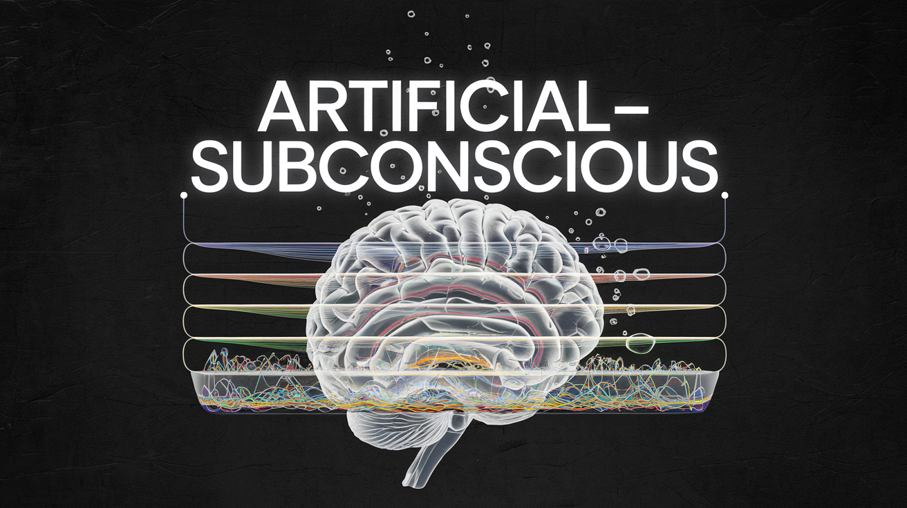

# Artificial Subconscious for AGI

## **Abstract**

Artificial intelligence (AI) systems traditionally rely on deterministic or goal-seeking models to achieve tasks, often lacking the nuanced depth of human-like intuition. The **Artificial Subconscious** is a conceptual framework designed to emulate subconscious processing, acting as an intrusive thought suggestion mechanism rather than a goal-seeking entity. This system generates hypothetical scenarios, evaluates potential outcomes, and introduces creative variability into the decision-making process. 

Operating continuously in the background, the **Artificial Subconscious** pairs with other AI components to enhance adaptability, creativity, and alignment with human-like cognition. While no implementation exists yet, the framework lays the foundation for an innovative layer in AI architecture.

---

## **Introduction**

Human cognition is multi-layered, with the subconscious playing a critical role in forming intrusive thoughts that can guide conscious decision-making, spark creativity, or mitigate risk. Unlike conventional AI systems that explicitly pursue goals, the **Artificial Subconscious** is envisioned as a passive, always-on process, continuously generating possible scenarios and injecting them into other systems for consideration.

This framework is designed to complement existing goal-seeking AI systems, offering valuable insights through its ability to imagine, suggest, and balance possibilities without dictating outcomes. This document outlines the conceptual structure and processes of the **Artificial Subconscious**, emphasizing its theoretical nature and potential integration with broader AI architectures.

---

## **Objective**

The **Artificial Subconscious** is not goal-driven. Instead, its primary objective is to continuously produce and evaluate hypothetical scenarios that other AI systems can interpret, adopt, or discard. This introduces creative variability and life-like qualities to AI through its persistent and independent processing.

### **Key Functions**

1. **Scenario Generation:** Generate diverse, hypothetical future scenarios based on noise, memory, and patterns.
2. **Intrusive Thought Injection:** Continuously present suggestions or "what-if" scenarios to other AI systems.
3. **Non-Goal-Driven Adaptability:** Operate independently, adapting to changing inputs without explicit directives.
4. **Enhancement of Decision Systems:** Complement goal-oriented AI systems by offering a pool of ideas and risk-aware alternatives.

---

## **Framework Overview**

The **Artificial Subconscious** operates through a multi-layered architecture, simulating subconscious thought processes. Each layer is designed to process raw inputs, generate potential scenarios, and evaluate their utility and risk before presenting them as suggestions.

---

### **Layer 1: Noise and Memory Integration**

**Purpose:** Create a baseline for subconscious activity by integrating random variability (noise) with memory to simulate subconscious thought patterns.

#### **Mechanisms:**

1. **Random Noise Generation:**
   - Simulates subconscious creativity by introducing variability.
   - Ensures exploration of unconventional ideas.

2. **Memory Integration:**
   - Leverages past experiences to shape patterns.
   - Weights successes and risks to balance creativity with caution.

#### **Formula:**

$$
N = N_{\text{random}} + N_{\text{memory}}
$$

--- 

### **Layer 2: Significant Data Extraction**

**Purpose:** Identify meaningful patterns from the integrated data to balance success-driven insights with risk awareness and creativity.

**Process:**

1. **Peak Identification (Possible Successes):**
   - Extracts data points representing significant successes (peaks) from the integrated data.
   - Peaks are associated with patterns that have historically demonstrated high utility or reward.

2. **Valley Identification (Possible Risks):**
   - Identifies data points representing notable risks (valleys) to ensure awareness of potential pitfalls.
   - Valleys help contextualize and mitigate risks during decision-making.

3. **Controlled Randomness:**
   - Introduces variability around identified peaks and valleys, ensuring exploration of creative or unconventional associations.

---

### **Layer 3: Hypothetical Scenario Generation**

**Purpose:** Generate intrusive, hypothetical scenarios by combining extracted patterns with random variations.

#### **Mechanisms:**

- **Scenario Creation:** Continuously generates potential futures, ranging from plausible to highly imaginative.
- **Scenario Evolution:** Refines scenarios using new data and controlled randomness.

#### **Formula:**

$$
S_{\text{next}} = S_{\text{current}} + \Delta S_{\text{learning}} + \eta_{\text{random}}
$$

- **Evaluation Metrics:** Estimates potential benefits and risks for each scenario.

**Scenario Evaluation Formula:**

**Scenario Score = α × Benefit − γ × Risk**

- Scenario Score: Score assigned to each scenario.
- α, γ: Weighting coefficients for benefit and risk.

---

### **Layer 4: Scenario Evaluation and Ranking**

**Purpose:** Evaluate scenarios for their potential utility and risk, offering prioritized suggestions.

#### **Mechanisms:**

1. **Consolidation:**
   - Groups similar scenarios into clusters to identify common patterns and avoid redundancy.
   - Consolidation reduces cognitive and computational overload by focusing on distinct scenarios.

2. **Utility and Risk Balancing:**
   - Each scenario is evaluated using a composite score that considers:
     - Historical success rates, representing the likelihood of positive outcomes.
     - Scenario-specific risk factors, ensuring risk-aware ranking.

**Scenario Ranking Formula:**

$$
R_{\text{rank}} = \frac{R_{\text{score}} \cdot H_{\text{success}}}{1 + R_{\text{risk}}}
$$

---

### **Layer 5: Final Scenario Selection**

**Purpose:** Select the most promising scenarios for presentation to the system for further processing, balancing reward, risk, and diversity.

---

### **Process:**

1. **Selection Criteria:**
   - **Reward Potential** '$R(S_i)$': Scenarios are evaluated based on their intrinsic benefits, such as alignment with the system's overarching goals or their potential to create novel opportunities.
   - **Risk Adjustment** ($R_k(S_i)$): Risk scores are applied to penalize scenarios with higher potential for negative consequences.
   - **Diversity Factor** ($D_f$): A penalty is applied to scenarios that are too similar to previously selected options, ensuring variety in the final output.

2. **Weighted Scoring:**
   - Scenarios are ranked using a composite score that considers the interplay of reward, risk, and diversity.
   - The weighting coefficients ($\gamma$ and $D_f$) provide flexibility, allowing the system to prioritize safety, creativity, or exploration depending on the context.

3. **Thresholding and Filtering:**
   - A predefined threshold can be applied to eliminate scenarios that fall below an acceptable reward-to-risk ratio.
   - Scenarios deemed overly redundant or excessively risky are deprioritized to maintain a balanced selection set.

---

### **Enhanced Final Selection Score Formula:**

$$
S_{\text{final}} = \frac{R(S_i) - \gamma R_k(S_i)}{1 + D_f}
$$

**Where:**

$$
\begin{aligned}
& S_{\text{final}} : \text{Final composite score of a scenario.} \\
& R(S_i) : \text{Reward or benefit score associated with scenario } S_i. \\
& R_k(S_i) : \text{Risk score of scenario } S_i, \text{ weighted by a coefficient } \gamma. \\
& \gamma : \text{Risk tolerance coefficient, adjustable based on system objectives.} \\
& D_f : \text{Diversity factor, penalizing similarity to promote variety.}
\end{aligned}
$$

---

### **Key Enhancements**

- **Reward-Balanced Diversity:** 
  - The scoring formula ensures that the diversity factor ($D_f$) does not overly penalize scenarios with high reward potential.
  - By dynamically weighting $D_f$, the system avoids biasing against innovative or unconventional scenarios that are similar in structure but distinct in outcome.

- **Context-Specific Risk Tolerance:** 
  - The inclusion of $\gamma$ enables dynamic adjustment of the system’s tolerance for risk. This allows the framework to prioritize safer options in critical applications or take calculated risks in exploratory or creative tasks.

- **Filtering Redundancy:** 
  - Scenarios that closely resemble previously selected options (as determined by similarity metrics) are assigned higher $D_f$ values, reducing their likelihood of selection. This helps the system present a diverse and actionable range of scenarios for downstream processing.

---

### **Integration into the Artificial Subconscious Framework**

- **Input:** Layer 5 receives scored scenarios from Layer 4, which have already been evaluated for reward, risk, and historical success.
- **Processing:** It refines these scenarios by recalculating their scores with additional diversity-based penalties and risk-adjusted prioritization.
- **Output:** It outputs a final, ranked list of scenarios that are ready for presentation to other AI systems or modules.

---

### **Illustrative Example**

Suppose the system generates the following scenarios:

- **Scenario A:** High reward, moderate risk, and similar to other generated options.
- **Scenario B:** Moderate reward, low risk, and highly unique.
- **Scenario C:** High reward, high risk, and moderately unique.

Using the formula:

- **Scenario A** might be penalized heavily due to high similarity ($D_f$) despite its reward.
- **Scenario B** might achieve a high score due to low risk and high uniqueness ($1 + D_f$).
- **Scenario C** might fall in between, with a high reward offset by a high $R_k(S_i)$ score, depending on the risk tolerance coefficient ($\gamma$).

The final output would reflect a balanced set of scenarios, including diverse, low-risk options and carefully selected high-reward opportunities.

---

### **Summary**

Layer 5 acts as a decision filter that refines the set of hypothetical scenarios into an actionable output. By balancing reward, risk, and diversity, this layer ensures that the Artificial Subconscious provides meaningful and varied inputs to broader AI systems, enhancing adaptability and creativity while maintaining safety and relevance.

---

## Use Cases

### **1. Continuous Intrusive Suggestions**

- **Function:** Operates in the background, providing intrusive thoughts without disrupting primary AI systems.
- **Example:** A navigation AI suggests alternative routes based on hypothetical future traffic, accidents, or delays.

### **2. Strategic Risk Awareness**

- **Function:** Warns about potential risks by injecting cautionary scenarios.
- **Example:** An AI project manager considers "What if key resources fail?" scenarios during planning.

### **3. Creativity Enhancement**

- **Function:** Introduces imaginative and unconventional ideas.
- **Example:** A writing assistant generates unexpected plot twists by injecting intrusive "what-if" scenarios.

### **4. Companion System for Goal-Oriented AI**

- **Function:** Enhances adaptability by feeding diverse scenarios into goal-seeking AI systems.
- **Example:** An AI robot incorporates intrusive suggestions to explore alternative paths when encountering obstacles.

---

## **Conclusion**

The **Artificial Subconscious** is a conceptual framework that introduces a passive, background layer for generating and injecting intrusive thought-like suggestions into broader AI systems. Its non-goal-driven nature makes it uniquely suited to enhancing creativity, adaptability, and risk awareness in dynamic environments.

This framework is theoretical and has not yet been implemented. Future work will focus on coding, experimentation, and integration to validate its potential for bridging the gap between deterministic computation and human-like intuition.

---

*Note: This document focuses on the conceptual layers, processes, expectations, examples, results, and associated goals of the Artificial Subconscious framework. Technical implementation details will be developed and documented in future work.*
