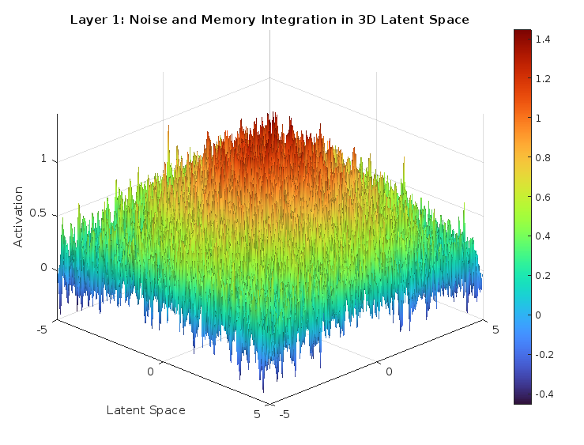

# Intrinsic Scenario Synthesis: Advancing Toward Subconscious Processing in AI

## **Abstract**

Artificial intelligence (AI) systems have traditionally operated on deterministic or goal-seeking models, focusing on explicit objectives and predefined pathways to achieve tasks. This approach often lacks the nuanced depth of human-like intuition and subconscious processing. The Intrinsic Scenario Synthesis (ISS) framework proposes a novel architectural layer that emulates subconscious thought processes within AI systems. Acting as an always-on generator of "intrusive thoughts," ISS continuously produces hypothetical scenarios, evaluates potential outcomes, and injects creative variability into the decision-making processes of connected AI systems.

By operating in the background and without explicit directives, ISS enhances adaptability, creativity, and risk awareness. It balances the exploration of unconventional ideas with the reliability of proven routines, aiming to bridge the gap between deterministic computation and human-like intuition. This paper outlines the conceptual structure, processes, and potential applications of ISS, laying the groundwork for future implementation and integration into broader AI architectures.

---

## **Introduction**

Human cognition is a complex, multi-layered system where the subconscious plays a critical role in guiding conscious thought, decision-making, creativity, and risk assessment. Subconscious processes often manifest as intrusive thoughts or spontaneous ideas that can influence actions without explicit intention. In contrast, conventional AI systems typically operate through explicit goal-seeking algorithms, lacking the depth and spontaneity of human subconscious processing.

The Intrinsic Scenario Synthesis (ISS) framework is envisioned to fill this gap by introducing a passive, background process within AI systems. ISS continuously generates possible scenarios, ranging from the highly plausible to the imaginative, and injects these into the system's decision-making pipeline. This approach allows AI systems to consider a broader range of options, enhancing creativity, adaptability, and risk awareness without dictating outcomes.

This document presents the theoretical underpinnings of ISS, detailing its multi-layered architecture, core components, and potential integration with existing AI systems. By emulating subconscious thought processes, ISS aims to advance AI towards more human-like cognition.

---

## **Objective**

The primary objective of the Intrinsic Scenario Synthesis (ISS) framework is to introduce a novel layer within AI architectures that emulates subconscious processing. ISS operates as a passive, always-on generator of hypothetical scenarios—"intrusive thoughts"—that enrich connected AI systems by providing creative variability, enhancing decision-making quality, and promoting risk-aware strategies.

### **Key Goals of ISS**

1. **Enhancing Decision-Making:**
   - **Broadening Perspectives:** By continuously providing a diverse range of plausible scenarios, ISS enables AI systems to consider options they might not independently generate.
   - **Improving Outcomes:** The inclusion of alternative possibilities can lead to more informed and optimal decisions.

2. **Creativity Injection:**
   - **Unconventional Ideas:** ISS introduces novel ideas by combining random variations with learned patterns from historical data.
   - **Innovation Facilitation:** Encourages AI systems to explore uncharted pathways, fostering innovation and creative problem-solving.

3. **Risk Mitigation:**
   - **Predictive Awareness:** By simulating potential pitfalls alongside successes, ISS promotes balanced decisions that account for risks.
   - **Preventative Strategies:** Helps in identifying and mitigating risks before they materialize.

The ISS framework's innovation lies in its ability to autonomously synthesize scenarios without explicit directives, acting as an idea generator that supplements higher-order decision systems.

---

## **Framework Overview**

The Intrinsic Scenario Synthesis framework operates through a multi-layered architecture designed to emulate subconscious thought processes. Each layer contributes to the generation, refinement, evaluation, and selection of hypothetical scenarios, ensuring a balance between creativity and practicality.

### **Core Components of ISS**

---

### **Layer 1: Noise and Memory Integration**

**Purpose:** Establish a foundational substrate for subconscious activity by integrating random variability (noise) with memory, simulating the spontaneous and associative nature of subconscious thought.

#### **Key Functions**

1. **Random Noise Generation:**
   - **Creativity Simulation:** Introduces stochastic elements to mimic the unpredictability of human thought.
   - **Exploration of Idea Space:** Enables the system to venture into unexplored areas by breaking away from deterministic patterns.

2. **Memory Integration:**
   - **Contextual Relevance:** Utilizes historical data, past experiences, and learned patterns to guide the generation of scenarios.
   - **Weighted Influences:** Assigns weights to memories based on factors such as recency, frequency, and success rates to influence scenario generation.

**Output:** A synthesized pool of data blending randomness with context-aware patterns, forming the basis for potential scenarios.

---

### **Layer 2: Significant Data Extraction**

**Purpose:** Distill meaningful patterns from the integrated data, identifying key opportunities (peaks) and risks (valleys) to inform scenario generation.

#### **Key Functions**

1. **Peak Identification (Possible Successes):**
   - **Pattern Recognition:** Analyzes the data to detect patterns associated with historical successes or high utility.
   - **Opportunity Highlighting:** Flags potential scenarios that could lead to favorable outcomes.

2. **Valley Identification (Possible Risks):**
   - **Risk Detection:** Identifies patterns linked to past failures or adverse events.
   - **Cautionary Indicators:** Marks scenarios that may require careful consideration or avoidance.

3. **Controlled Randomness:**
   - **Variability Introduction:** Adds slight randomness around identified peaks and valleys to explore variations.
   - **Avoiding Stagnation:** Prevents the system from becoming overly conservative by allowing for creative deviations.

**Output:** A refined set of data points representing significant opportunities and risks, ready for scenario generation.

---

### **Layer 3: Hypothetical Scenario Generation**

**Purpose:** Generate a diverse array of hypothetical scenarios by combining extracted patterns with controlled random variations.

#### **Key Functions**

- **Scenario Creation:**
  - **Continuous Generation:** Produces a steady stream of potential scenarios, ensuring the system remains proactive.
  - **Range of Possibilities:** Includes scenarios from highly plausible to imaginative, covering a broad spectrum.

- **Scenario Evolution:**
  - **Adaptive Refinement:** Updates scenarios based on new data inputs and feedback from connected systems.
  - **Learning Mechanisms:** Incorporates machine learning techniques to improve scenario quality over time.

- **Controlled Divergence:**
  - **Feasibility Balance:** Ensures that scenarios maintain a balance between novelty and practical applicability.
  - **Constraint Application:** Applies constraints to prevent scenarios from becoming irrelevant or excessively unrealistic.

**Mathematical Representation:**

$$
S_{\text{next}} = S_{\text{current}} + \Delta S_{\text{learning}} + \eta_{\text{random}}
$$

**Output:** A diverse set of hypothetical scenarios prepared for evaluation.

---

### **Layer 4: Scenario Evaluation and Ranking**

**Purpose:** Assess the generated scenarios for their potential utility and risk, providing a prioritized list for further consideration.

#### **Key Functions**

1. **Consolidation:**
   - **Clustering Techniques:** Groups similar scenarios using clustering algorithms to identify common themes.
   - **Redundancy Reduction:** Eliminates duplicate or overly similar scenarios to streamline processing.

2. **Utility and Risk Balancing:**
   - **Composite Scoring:** Evaluates scenarios using a multi-criteria scoring system.
   - **Historical Success Metrics:** Incorporates past performance data to inform likelihood of success.
   - **Risk Assessment:** Analyzes potential downsides or hazards associated with each scenario.

**Output:** A ranked list of scenarios with associated scores, facilitating informed selection.

---

### **Layer 5: Surface-Level Scenario Selection**

**Purpose:** Select and prepare the most promising scenarios for presentation to connected AI systems, ensuring a balance between proven routines and innovative alternatives.

#### **Key Functions**

1. **Selection Criteria:**
   - **Reward Potential**: Evaluates the expected benefits of each scenario.
   - **Routine Success Factor**: Prioritizes scenarios with a track record of success.
   - **Diversity Factor**: Ensures inclusion of unique or novel scenarios.

2. **Weighted Scoring:**
   - **Dynamic Adjustment:** Allows for real-time tuning of weighting coefficients based on system objectives.
   - **Composite Evaluation:** Integrates multiple factors to produce a final score for each scenario.

3. **Thresholding and Filtering:**
   - **Minimum Standards:** Applies thresholds to exclude scenarios below a certain score.
   - **Redundancy Penalization:** Reduces the priority of overly similar, less effective scenarios.

**Output:** A curated set of scenarios, optimized for actionability and ready for integration into the decision-making processes of connected AI systems.

---

### **Operational Mechanics of ISS**

1. **Continuous Operation:**
   - **Background Processing:** ISS functions autonomously, requiring no explicit triggers to operate.
   - **Real-Time Adaptation:** Responds to changes in data inputs and system feedback dynamically.

2. **Complementary Role:**
   - **Non-Intrusive Integration:** Enhances existing AI systems without interfering with their primary functions.
   - **Decision Support:** Provides additional context and options, enriching the decision-making landscape.

3. **Adaptive Feedback Loop:**
   - **Learning from Outcomes:** Updates its internal models based on the success or failure of suggested scenarios.
   - **Alignment Improvement:** Continuously refines scenario generation to better match the objectives of connected systems.

By functioning as an AI subconscious, ISS empowers systems to transcend deterministic limitations, fostering a more holistic and adaptable form of intelligence.

---

## **Use Cases**

### **1. Continuous Intrusive Suggestions**

- **Function:** Operates unobtrusively in the background, offering spontaneous suggestions that may enhance performance or efficiency.
- **Example:** A smart home system proposes energy-saving adjustments based on hypothetical future usage patterns.

### **2. Strategic Risk Awareness**

- **Function:** Provides foresight into potential challenges, allowing systems to preemptively address issues.
- **Example:** An AI financial advisor anticipates market downturns by considering "what-if" economic scenarios.

### **3. Creativity Enhancement**

- **Function:** Injects novel ideas and approaches into processes that benefit from innovation.
- **Example:** A design AI suggests unique architectural features by exploring unconventional combinations of styles.

### **4. Companion System for Goal-Oriented AI**

- **Function:** Augments goal-driven AI by supplying alternative strategies and solutions.
- **Example:** An autonomous vehicle's navigation system considers scenic routes or detours suggested by ISS, enhancing passenger experience.

### **5. Adaptive Learning Environments**

- **Function:** Personalizes learning experiences by proposing tailored educational scenarios.
- **Example:** An AI tutor generates custom exercises based on hypothetical student misunderstandings or interests.

---

## **Conclusion**

The Intrinsic Scenario Synthesis (ISS) framework represents a significant step towards integrating subconscious-like processing within AI systems. By continuously generating and evaluating hypothetical scenarios, ISS enhances creativity, adaptability, and risk awareness, bridging the gap between deterministic algorithms and human-like intuition.

While the framework is currently theoretical, its potential applications span various domains, offering a new dimension to AI capabilities. Future work will focus on developing practical implementations, conducting experiments, and integrating ISS into existing AI architectures to validate its effectiveness and refine its mechanisms.

---

*Note: This document focuses on the conceptual layers, processes, expectations, examples, and associated goals of the ISS framework. Technical implementation details, including specific algorithms and coding considerations, will be developed and documented in future work.*

